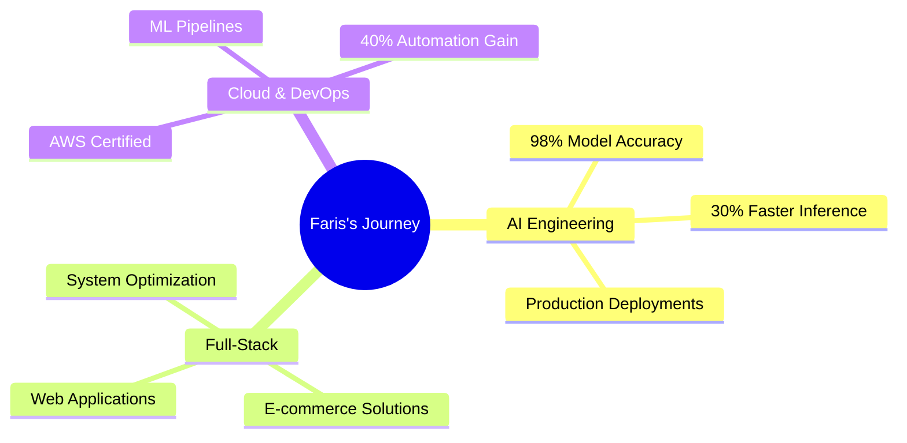

<div align="center">


</div>

<!-- Profile Views Counter -->
<p align="left">
    
</p>

<!-- About Me Section -->
## 🤖 About Me

```typescript
const faris = {
    location: "Middle East 🌍",
    role: "AI Engineer & Full-Stack Developer",
    skills: {
        ai_ml: ["Deep Learning", "Computer Vision", "NLP"],
        cloud: ["AWS", "GCP", "SageMaker"],
        languages: ["Python", "JavaScript", "PHP"],
        tools: ["PyTorch", "TensorFlow", "React", "Laravel"]
    },
    currentFocus: "Building production-grade AI solutions",
    funFact: "I can explain AI concepts to both machines and humans! 🤓"
};
```

<!-- Activity Section -->
## 🚀 What I'm Up To

<table>
  <tr>
    <td width="50%">
        
    </td>
    <td width="50%">
        
    </td>
  </tr>
</table>

<!-- Skills Section -->
## 🛠️ Tech Arsenal

<div align="center">

<br>


</div>

<!-- Projects Section -->
## 🌟 Featured Projects

<div align="center">
<a href="YOUR_REPO_LINK">
  
</a>
<a href="YOUR_REPO_LINK">
  
</a>
</div>

<!-- Achievements Section -->
## 🏆 Achievements
<div align="center">



</div>

<!-- GitHub Stats Section -->
## 📊 GitHub Stats

<div align="center">
    <picture>
        <source media="(prefers-color-scheme: dark)" srcset="https://github-readme-streak-stats.herokuapp.com/?user=Darwee4&theme=github-dark-blue&hide_border=true">
        <source media="(prefers-color-scheme: light)" srcset="https://github-readme-streak-stats.herokuapp.com/?user=Darwee4&theme=default&hide_border=true">
        
    </picture>
</div>

<!-- Connect Section -->
## 🤝 Let's Connect

<div align="center">
    <a href="https://linkedin.com/in/XFD">
        
    </a>&nbsp;&nbsp;
    <a href="mailto:XFarisDarwish@gmail.com">
        
    </a>&nbsp;&nbsp;
    <a href="YOUR_PORTFOLIO_LINK">
        
    </a>
</div>

<!-- Fun Footer -->
<div align="center">
    
</div>
