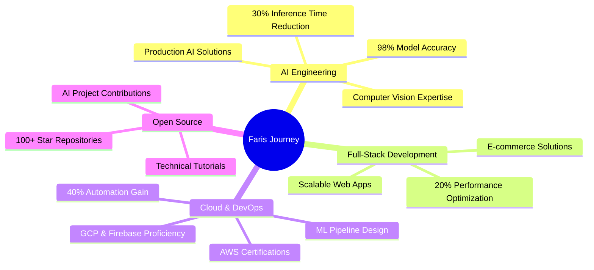

<div align="center">


</div>
# 👋 Profile Views


## 🤖 About Me

```typescript
const faris = {
    location: "Middle East 🌍",
    role: "AI Engineer & Full-Stack Developer",
    skills: {
        ai_ml: ["Deep Learning", "Computer Vision", "NLP"],
        cloud: ["AWS", "GCP", "SageMaker"],
        languages: ["Python", "JavaScript", "PHP"],
        tools: ["PyTorch", "TensorFlow", "React", "Laravel"]
    },
    currentFocus: "Building production-grade AI solutions",
    funFact: "I can explain AI concepts to both machines and humans!"
};
```

## 📊 Activity

| GitHub Activity | Top Languages |
|----------------|---------------|
|  |  |

## 🛠️ Tech Arsenal


## 🏆 Achievements



## 🤝 Let's Connect

[](https://www.linkedin.com/in/XFD)
[](mailto:XFarisDarwish@gmail.com)
[](https://github.com/Darwee4)

<p align="center">
    
</p>

---


